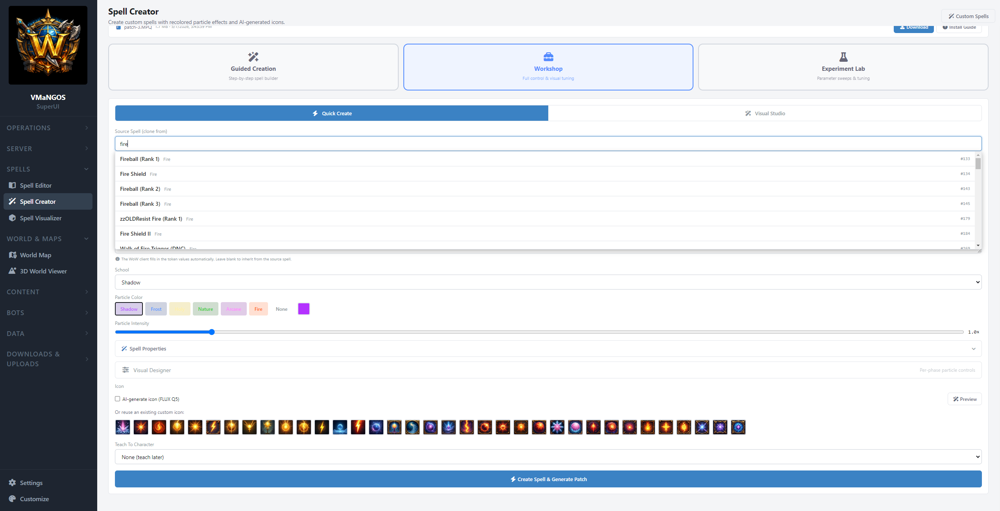

# MangosSuperUI

https://www.youtube.com/@Yafrovon — Video walkthroughs and feature demos

A web-based server management, content development, and world building platform for [VMaNGOS](https://github.com/vmangos/core) 1.12.1 vanilla WoW private servers. Built with ASP.NET Core 8.0 MVC, jQuery, Three.js, and MariaDB/MySQL. Runs on Linux, developed on Windows.

## Why This Exists

I run a private VMaNGOS server at home — not public, just for me. I wanted a single tool that brought together server ops, content editing, world building, spell creation, 3D terrain visualization, and AI-driven playerbots without requiring SQL expertise or scattered command-line tools. I looked for one and didn't find it — not for VMaNGOS, and not for any emulator.

So I'm building it. The end goal is a living game world with hundreds of AI-driven bots that feel real, custom spells and items that feel vanilla but add flavor, and the tooling to iterate on all of it from a browser.

I'm open-sourcing it because if I needed this, other people running VMaNGOS — or those who want to immortalize vanilla WoW — probably could too. It's not polished product software. It's a tool I use daily. Feedback, bug reports, and contributions are welcome.

> **⚠️ Work in Progress:** MangosSuperUI is functional and actively used, but it is not finished. Some planned sections (vendors, creatures, quests) are not yet built.


## Disclaimer

This project is not affiliated with or endorsed by Blizzard Entertainment.
World of Warcraft® is a registered trademark of Blizzard Entertainment, Inc.
MangosSuperUI does not distribute any Blizzard assets — icons, models, and minimap tiles are extracted from your own WoW 1.12.1 client using the included [Extractor tool](https://github.com/Yafrovon/MangosSuperUI_Extractor).

---

## Features

### Server Operations

**Dashboard** — At-a-glance server health with a built-in **Diagnose** button that probes every subsystem and tells you specifically *why* something is broken. Process status for mangosd and realmd (with auto-detection of process names via `/proc` scanning), RA connection status, all five database connections, players online, uptime, core revision. First-run detection shows a setup banner when configuration is missing.

**Console** — Full RA terminal in the browser via SignalR. Send any GM command, see responses in real time. Command history and autocomplete.

**Players & Accounts** — Search, inspect, and manage characters and accounts. Kick, mute, ban, teleport, send mail/items, adjust GM levels. Everything audit-logged.

**Config Editor** — All 601 `mangosd.conf` settings organized into 22 human-readable tabs with descriptions and inline editing. Built from a curated metadata mapping — no more hunting through a 2,000-line conf file.

**Activity Log** — Append-only audit trail. Every action recorded with operator, IP, full before/after state snapshots, RA commands, and timestamps. Filter by category, action, or target.

**Live Logs** — Real-time log tailing via SignalR. Streams new log lines to the browser every 500ms.

**Backup & Restore** — Three backup groups (Game World databases, Characters, Core Source). Timestamped snapshots with `mysqldump`, one-click restore, auto-safety snapshots before destructive operations. Labels, stats, audit-logged.

### Content Editing

**Items** — Browse 25,000+ items. Search, filter, paginate. Full detail panel with stats, spells, and loot sources. 3D model viewer for weapons/shields/objects. Clone base game items to create custom variants. Icon picker with DBC-resolved names.

**Spells** — Browse, search, and batch-edit the spell_template table. Grouped search across spell families. DBC-resolved icons, duration, cast time, and range.

**Game Objects** — Browse, search, clone, edit, delete. 3D model viewer. Custom summary field. Integration with World Map for visual placement.

**Loot Tuner** — Bulk loot rate adjustment by quality, level, rank, or instance. Baseline diffs and one-click reset to original values.

**Instance Loot** — Per-boss loot editing for all 26 instances (~256 curated bosses). Full loot tree with reference chain expansion. Edit drop rates, add/remove items.

**ARPG Lootifier** — Diablo-style item variant generator. Tier-quota system (Improved, of Power, of Glory, of the Gods), stat family detection, spell-effect items, quality promotion to Epic/Legendary, boss-named legendaries at 150% budget. Batch mode across entire dungeons/raids with full rollback.

### World Building

**World Map** — Leaflet.js minimap viewer for all continents, dungeons, and raids. Click-to-place game objects with automatic terrain Z resolution from VMaNGOS `.map` files. Spawn overlay, compass widget, orientation control.

**3D World Viewer** — Browser-based Three.js terrain renderer that reads directly from WoW 1.12.1 client MPQ archives. Features include:
- V9 heightmap geometry with server-side RGB composite textures
- M2 doodad models with per-submesh textures and InstancedMesh batching
- WMO building rendering with full textured geometry
- Spatial streaming with spherical load/unload
- PBR golden hour lighting with Lit/Flat toggle
- Walk mode (WASD + right-click FPS look + ground follow)
- **WMO Placement Tool** — browse all WMOs from MPQ listfiles, ghost placement on terrain with rotation and height adjust, persist to database, commit to game world (gameobject_template + gameobject + DBC patching + patch MPQ generation)


### Spell Creator

A complete custom spell creation pipeline from concept to playable in-game. Create spells with unique visuals, register them at trainers, and generate client patches — all from the browser.

- **Guided Wizard** — 6-step creation flow: search source spell → identity → power presets → appearance (color, intensity, per-phase fine-tune, icon) → ranks & training → review & create
- **Workshop** — per-phase particle controls with independent color, texture, and emission settings
- **Experiment Lab** — SpellDNA extreme parameter testing for discovering visual effects
- **Visual Lab** — Three.js particle renderer with spatial caster/target markers, missile travel, sequence playback, and terrain presets
- **AI-powered visuals** — ComfyUI/FLUX icon generation, AI texture generation (7 themes × 6 roles), Ollama prompt crafting
- **Rank chain system** — auto-generates full rank progressions (e.g. 12 Fireball ranks) with proportional damage/mana scaling
- **Trainer registration** — copy-from-source or add-to-all-class-trainers with SPELL_EFFECT_LEARN_SPELL wrapper generation
- **Unified patch** — single `patch-3.MPQ` for all custom spells including all DBC entries, icons, textures, and M2 particles



### AI Playerbots

An AI-driven playerbot system with behavioral decision engine, LLM-powered chat, and real economy interaction.

- **Bot Tuner Dashboard** — roster, personality bars, decision weights, real economy display, inventory with icons, activity timeline
- **Behavioral Engine** — domain-based decision system: Questing (full quest graph with sub-phase sequencer), Economy (vendoring, training, repair), Combat (grinding, corpse run), Social (LLM chat via Ollama)
- **Multi-class groups** — warrior + priest + paladin + mage grouping system
- **Real integration** — bots use real character_inventory, real gold, real spell progression. No shadow state.
- **C++/C# split** — low-latency AI in C++ (movement, combat, looting), high-level decisions in C# (quest selection, vendor logic, personality)

### Data & Development

**Database Explorer** — Universal browser for all 255 tables across 4 VMaNGOS databases. This isn't phpMyAdmin — it treats the schema as a connected graph.
- 749 curated relationship edges (discovered via brute-force column overlap testing)
- Inline editing with audit-logged before/after state
- Relationship panel with expand-to-see-rows navigation
- Interactive SVG ER diagrams with radial layout


**Source Map** — C++ source tree explorer for VMaNGOS development. 4-layer indexing (files, symbols, types, enums), interactive call graph visualization, inline source preview, trace export. Built for understanding VMaNGOS internals without an IDE.

**OG Baseline System** — Pristine snapshots of your mangos tables before editing. Field-level diffs on every content page. One-click reset at any granularity.

**Downloads** — Host addon ZIPs for players. Auto-generates `Catalog.lua` for the MangosSuperUI_Placer WoW addon.

**Settings** — Full path and credential configuration through the web UI. DBC file status, ComfyUI node pool monitoring, Ollama connectivity. Configuration override system (`server-config.json` over `appsettings.json`).

---

## Architecture

Every page follows the same pattern:

```
Controller (C#)          →  View (Razor .cshtml)      →  JS file (jQuery)
Routes, DB queries,         Thin HTML shell,              All dynamic rendering,
RA commands, audit          scoped CSS                    AJAX calls, DOM updates
```

Key services:

| Service | Role |
|---------|------|
| **RaService** | Singleton persistent TCP to mangosd RA. App-level keepalive, prompt-based read, auto-reconnect. |
| **AuditService** | Append-only audit trail with before/after state snapshots. |
| **ProcessManagerService** | Process detection via `/proc` scanning with 3-strategy fallback. Systemd start/stop/restart. |
| **DbcService** | Parses 1.12.1 DBC binary files at startup for icon/spell/item metadata. |
| **HeightMapService** | Reads VMaNGOS `.map` binary files for terrain Z resolution. |
| **BotBridgeService** | TCP bridge (port 3444) between C++ AiBot AI and C# behavioral engine. |
| **BotBrainService** | Decision loop orchestrator, domain routing, Ollama LLM dispatch. |
| **PatchBuilderService** | DBC/M2/MPQ pipeline for Spell Creator unified patch generation. |
| **SpellTextureService** | AI texture generation via ComfyUI/FLUX with BLP conversion. |
| **SourceIndexerService** | C++ source tree indexer for Source Map (files, symbols, types, enums). |
| **ComfyUIDispatcher** | Multi-node ComfyUI pool with channel-based token allocation. |

Database access uses Dapper for VMaNGOS tables (raw SQL, read-heavy) and auto-created tables in `vmangos_admin` for MangosSuperUI's own state. All SQL identifiers validated against schema whitelists.

---

## Requirements

- A working **VMaNGOS 1.12.1** server (compiled, databases populated, able to log in and play)
- **Ubuntu 22.04+** or similar Linux (tested on Ubuntu 24.04 LTS)
- **ASP.NET Core 8.0 Runtime** (or SDK if building from source)
- **MariaDB 10.x+** or MySQL 5.5+
- **WoW 1.12.1 client** (for asset extraction — optional but recommended)

Optional for advanced features:
- **Ollama** with a model like `qwen3:4b` (for Spell Creator prompts + AiBot chat)
- **ComfyUI** with FLUX (for AI icon/texture generation)
- **Python 3 + mpyq** (for M2/BLP extraction on the server)

---

## Installation

See **[INSTALL.md](INSTALL.md)** for the full step-by-step guide covering:

- **Part 1:** VMaNGOS prerequisites — RA configuration (including the critical `Ra.MinLevel` gotcha), systemd services, account setup, sudo permissions
- **Part 2:** MangosSuperUI deployment — .NET runtime, download/build, systemd service, setup script, dashboard verification with Diagnose button
- **Part 3:** Asset extraction — icons, 3D models, and minimap tiles from your WoW client
- **Part 4:** SpellCreator & WorldViewer assets — M2/BLP extraction via python mpyq
- **Part 5:** Validation script — comprehensive audit of your entire installation

The setup script auto-discovers your VMaNGOS paths, database connections, and configuration from `mangosd.conf`. The Dashboard's Diagnose button actively tests every subsystem and tells you specifically what needs fixing.

---

## Roadmap

### Built and Working

Everything listed in [Features](#features). Server management, content editors, world map, 3D world viewer with WMO placement, spell creator with AI visuals, AI playerbots with LLM chat, database explorer with ER diagrams, source map, backup system, full audit trail.

### In Progress

- **WorldViewer client rendering** — WMO placements commit to the game database but client-side rendering of custom displayIds needs investigation
- **Cave/interior WMO rendering** — group file loading and DoubleSide material for interior geometry
- **GPU instancing optimization** — `InstancedMesh` fetch queue throttling and distance-based LOD culling

### Planned

- **Vendors & Creatures** — NPC browsing, vendor inventory editing, trainer spell lists
- **Quests** — quest template editor, quest reward lootification
- **Game Tuning** — XP/honor/reputation rate sliders
- **Docker Compose** packaging for one-command deployment
- **Smart quest reward choice** for bots (ScoreItem comparison)
- **Sound integration** for Spell Creator via SoundEntries.dbc

### Development Philosophy

If any single feature hits a wall beyond ~50 hours, I skip it and move on. Steady forward momentum across the whole platform rather than getting stuck on one piece.

---

## Tech Stack

| Layer | Technology |
|-------|-----------|
| Backend | ASP.NET Core 8.0 MVC (C#) |
| Frontend | jQuery, vanilla JS |
| 3D Rendering | Three.js r128 (World Viewer, Visual Lab) |
| Real-time | SignalR (Console, Live Logs, Bot Bridge) |
| Database | MariaDB/MySQL via Dapper |
| 3D Models | Google `<model-viewer>` (GLB), Three.js (terrain/WMO/M2) |
| World Map | Leaflet.js with custom tile layers |
| AI Inference | Ollama (LLM chat/prompts), ComfyUI/FLUX (icons/textures) |
| MPQ/BLP/DBC | War3Net.IO.Mpq, custom binary parsers |
| Asset Extraction | [MangosSuperUI Extractor](https://github.com/Yafrovon/MangosSuperUI_Extractor) (WinForms + War3Net) |

---

## Project Structure

```
MangosSuperUI/
├── Controllers/          # ~25 controllers — one per page + API endpoints
├── Services/             # ~30 services (RA, Audit, DBC, Patch, Texture, Bot, etc.)
├── BotLogic/             # AI playerbot behavioral engine (domains, tracking, data loaders)
├── Models/               # ConnectionFactory, POCOs
├── Hubs/                 # SignalR hubs (Console, Live Logs, Bot Bridge)
├── Views/                # Razor views — thin HTML shells
├── wwwroot/
│   ├── js/               # One JS file per page — all dynamic rendering lives here
│   ├── css/              # Global theme, baseline styles
│   ├── data/             # Curated JSON (commands, config metadata, relationships, etc.)
│   ├── lib/              # Vendored libs (Leaflet, model-viewer, Three.js r128)
│   ├── addons/           # MangosSuperUI_Placer WoW addon
│   ├── icons/            # Item/spell icon PNGs (user-extracted)
│   ├── models/           # Game object GLB models (user-extracted)
│   ├── item_models/      # Item GLB models (user-extracted)
│   └── minimap/          # Minimap tile PNGs (user-extracted)
└── sql/                  # vmangos_admin schema
```

---

## Contributing

See **[CONTRIBUTING.md](CONTRIBUTING.md)** for the full guide. The short version:

Open an issue before submitting a PR. Bug reports, feature requests, and documentation improvements are all welcome.

If you're adding a new page, follow the existing pattern: C# controller for routing and data, thin Razor view for the HTML shell, JS file for all dynamic rendering. Keep VMaNGOS database writes going through RA commands where possible, with direct SQL for content tables — and always audit-log the before/after state.

---

## Acknowledgments

MangosSuperUI was built with [Claude](https://claude.ai) (Anthropic) as a primary development resource — the same way I use it in my professional work. Claude was instrumental in architecture decisions, code generation, debugging, and documentation across the entire project.

None of this would exist without the years of work by the VMaNGOS team and the broader MaNGOS lineage. The WoW modding community that reverse-engineered DBC formats, M2 particle systems, loot table mechanics, stat budget formulas, and the RA protocol. The wiki editors, forum posters, and GitHub contributors who wrote it all down so someone like me could find it fifteen years later. MangosSuperUI is a UI layer on top of knowledge that thousands of people contributed over two decades. I just made it clickable.

---

## License

This project is licensed under the **GNU General Public License v2.0**. See [LICENSE](LICENSE) for the full text.

Third-party library licenses are documented in [THIRD_PARTY_NOTICES.md](THIRD_PARTY_NOTICES.md).
